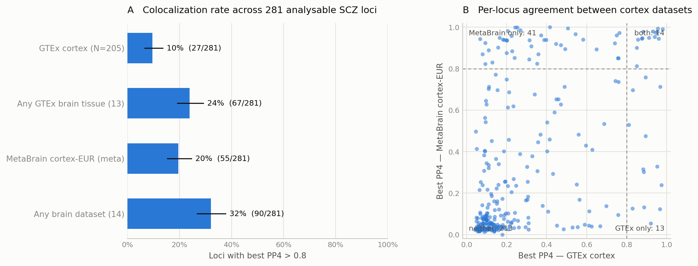

# Stage 1 — Replication baseline: how many PGC3 SCZ loci colocalize with a brain eQTL?

**Date:** 2026-08-11 · **Pipeline:** commit at time of run (see git log) · Full run on `workstation`, 7,944/7,944 Snakemake steps, 0 errors.
Committed artifact snapshot: [`docs/stage1_results/`](stage1_results/) (per-locus table, summary JSON, figure). Everything regenerates from raw downloads via `snakemake -s workflow/Snakefile all`.

## Headline result

Of **281 analysable PGC3 SCZ loci** (287 total − 1 MHC − 5 chrX):

| Dataset class | Loci with best PP4 > 0.8 | Fraction (Wilson 95% CI) |
|---|---|---|
| GTEx v8 cortex (N=205) | 27 / 281 | **9.6%** (6.7–13.6%) |
| MetaBrain cortex-EUR (meta-analysis, per-SNP N up to ~6,600) | 55 / 281 | **19.6%** (15.4–24.6%) |
| Any of 13 GTEx brain tissues | 67 / 281 | **23.8%** (19.2–29.2%) |
| **Any of 14 brain datasets** | **90 / 281** | **32.0% (26.8–37.7%)** |

The "missing regulation" gap replicates clearly: **two-thirds of genome-wide-significant SCZ loci show no colocalizing brain eQTL** even when 14 datasets are given the chance, and even the best single dataset (MetaBrain) explains under 20%.

## Three observations that set up Stage 2

1. **The miss is not because eQTLs are absent.** Of the 191 loci with no colocalization anywhere, **180 (94%) contain at least one gene with a brain eQTL at p < 1e-6** inside the ±1 Mb window. Across all loci, 6,859 gene×dataset pairs combine a strong eQTL (p < 1e-8) with PP3 > 0.8 — strong evidence for *distinct* causal variants for expression and disease (253 loci involved). This is the allelic-heterogeneity / context-specificity signature Stage 2 will dissect.
2. **eQTL sample size matters but does not close the gap.** MetaBrain (an order of magnitude larger than GTEx cortex) doubles the colocalization rate (9.6% → 19.6%) — consistent with a power component (Stage 2b) — yet 80% of loci still fail in the best-powered cortex resource.
3. **Cortex datasets disagree at the locus level.** Only 14 loci colocalize in *both* GTEx cortex and MetaBrain; 41 are MetaBrain-only and 13 GTEx-only (panel B). Dataset-specific power, cohort composition (MetaBrain includes aging/AD cohorts), and winner's-curse PP4 near the 0.8 threshold all plausibly contribute; Stage 2 treats threshold sensitivity explicitly.

## Positive controls reproduce

The strongest per-locus colocalizations include canonical, independently validated SCZ effector genes:

| Locus | Gene | Dataset | PP4 |
|---|---|---|---|
| 15-rs4702 | **FURIN** | MetaBrain cortex | 0.99996 |
| 19-rs322124 / 19-rs72986630 | **ZNF823** | MetaBrain cortex | 0.9998 |
| 17-rs6504163 | ACE | MetaBrain cortex | 0.993 |

(FURIN/rs4702 is the standard experimental benchmark for SCZ variant-to-gene, which the pipeline recovers at the top of the list.)

## Methods (parameters live in `config/config.yaml`)

- **GWAS:** PGC3 SCZ primary autosome meta-analysis (67,390 cases / 94,015 controls; per-SNP N used), 7,585,069/7,585,077 variants pass QC; lifted hg19→GRCh38 (99.94% mapped; all drops counted by reason). Loci = Trubetskoy Supplementary Table 3 (SHA256-pinned), regions = index SNP ±1 Mb; index-SNP positions verified by independent CrossMap vs rsID-lookup agreement (281/281).
- **coloc:** `coloc.abf` (coloc 5.2.3), default priors (p1=p2=1e-4, p12=1e-5), per gene over variants matched on GRCh38 chrom:pos:allele-pair; ≥25 shared variants required (1,196 gene×locus×dataset combinations excluded on this, 157,210 tested, 5 locus×dataset pairs had no eQTL data — all recorded, nothing silently dropped).
- **GWAS side:** beta/varbeta (log-OR), type=cc. **GTEx side (eQTL Catalogue):** beta/SE/MAF native, N from registry. **MetaBrain side:** native Meta-Beta/Meta-SE and per-SNP N; MAF from PGC3 control frequencies of the matched variant (public MetaBrain release ships no allele frequencies) — documented approximation.

## Limitations to carry forward

1. `coloc.abf` assumes **one causal variant per trait per region** — exactly the assumption Stage 2a relaxes with SuSiE credible sets + coloc-SuSiE. At loci with allelic heterogeneity the single-variant assumption biases PP4 downward, so the Stage 1 fractions are conservative by construction.
2. GWAS is EUR+EAS ("primary") while all eQTL panels are European-ancestry; an EUR-only GWAS sensitivity run is queued for Stage 2.
3. MetaBrain MAF borrowed from GWAS controls (affects sdY scaling of the eQTL prior, second-order for PP4).
4. PP4 > 0.8 is strict; threshold sensitivity (0.5, 0.7, 0.9) will be reported in Stage 2/3.
5. isoform/splicing QTLs (PsychENCODE isoQTL, GTEx sQTL) not yet included — expression-level only in this baseline.

## Stage 2 target set

The **191 non-colocalizing loci** (180 with strong local eQTLs) are written in `per_locus_table.tsv` (`coloc_any_brain == False`). Stage 2 tests, per locus: (a) multi-signal architecture via SuSiE/coloc-SuSiE, (b) eQTL power scaling across the N=114→586→~6,600 ladder, (c) cell-type dilution vs Bryois et al. sc-eQTLs, (d) fetal-specific regulation (Walker 2019 fetal eQTL + Roadmap fetal chromHMM enrichment).
