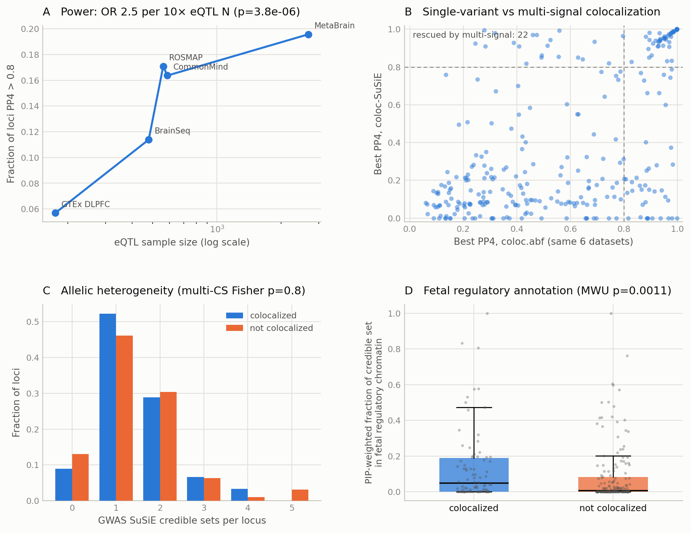

# Stage 2 — Dissecting the miss: why don't SCZ loci colocalize with brain eQTLs?

**Date:** 2026-08-11 · 281 analysable loci · artifact snapshot in [`docs/stage2_results/`](stage2_results/) · everything regenerates via `snakemake results/stage2/explanations.tsv results/stage2/fig_stage2.png`.

Stage 1 found 90/281 loci (32%) with any brain-eQTL colocalization (PP4 > 0.8 across 14 bulk datasets). Stage 2 tested four competing explanations for the 191 misses, quantitatively.

## The ledger

| Explanation tested | Loci newly "explained" | Verdict |
|---|---|---|
| Stage 1 bulk coloc (baseline) | 90 | — |
| (a) Multi-signal rescue (coloc-SuSiE) | +23 | real but symmetric — see below |
| (c) Single-cell-only coloc (8 Bryois cell types) | +6 | real, small at N=192; excitatory-neuron-dominated |
| (d) Fetal-only coloc (Walker neocortex) | +4 | smallest direct contribution |
| **Cumulative explained** | **123 / 281 (44%)** | |
| **Unexplained** | **158 / 281 (56%)** | the enduring "missing regulation" core |

*(Counts reflect the regenerated pipeline state; one borderline rescue crossed the 0.8 threshold when SuSiE outputs were re-derived with LD diagnostics, moving the original 22 to 23.)*

## (a) Allelic heterogeneity: it reshapes the answer more than it enlarges it

- GWAS-side SuSiE (1000G EUR LD, 279/281 converged): 33 loci form no credible set; 113 loci (40%) carry **≥2 credible sets** — multi-signal architecture is the norm, not the exception.
- But multi-CS loci are **not** enriched among non-colocalizing loci (40.8% vs 38.9%; Fisher p = 0.80). Heterogeneity alone does not explain the misses.
- The striking result is **churn**: among the 85 loci that coloc.abf calls colocalized within the six datasets with eQTL-side SuSiE, **23 (27%) are demoted** — the fine-mapped signals separate (PP3 dominates; e.g. the Stage-1-validated 22-rs9607782/ENSG00000232710 pair dissolves to PP3 = 0.98 with peaks ~30 kb apart). Conversely **22 misses are rescued** when signals are paired individually (e.g. 8-rs4129585: abf 0.56 → SuSiE 0.99). Single-causal-variant coloc misclassifies in both directions at similar rates — the *identity* of "colocalized" loci changes by roughly a quarter, even though the headline fraction barely moves.

## (b) eQTL power: strong, significant, and saturating

Colocalization scales with eQTL sample size (logistic OR = **2.5 per 10× N**, p = 3.8e-6) across the DLPFC ladder: 5.7% (GTEx DLPFC, N=175) → 11.4% (BrainSeq, 479) → 17.1% (ROSMAP, 560) → 16.4% (CommonMind, 586) → 19.6% (MetaBrain meta, N≈2,700). But the curve visibly flattens: the last 4.6-fold increase in N buys three percentage points. Extrapolation puts the bulk-cortex ceiling around ~25% — **power explains part of the gap but cannot close it.**

## (c) Cell-type dilution: real signal, currently sample-size-limited

37/281 loci colocalize with ≥1 of 8 single-cell cell types at only N=192 donors — per-sample the sc-eQTLs are remarkably productive (compare GTEx DLPFC: 16 loci at N=175 bulk). Excitatory neurons dominate (23), then oligodendrocytes (12). 13 loci are found by sc but not by either bulk cortex resource; 6 are found by nothing else at all. Given the power curve in (b), the cell-type explanation should scale substantially as sc-eQTL cohorts grow.

## (d) Fetal / context specificity: weakest direct support, with an instructive twist

- Fetal eQTL coloc adds only 4 loci not otherwise explained.
- Credible-set chromatin annotation goes **against** the fetal-enhancer hypothesis as stated: non-colocalizing loci have *lower* PIP-weighted overlap with fetal regulatory chromatin than colocalizing loci (0.084 vs 0.138, MWU p = 0.0011) — and the deficit is even stronger for adult regulatory chromatin (0.048 vs 0.136, p < 1e-4). Fetal-not-adult overlap shows no difference (p = 0.89).
- Reading: the misses are not hiding in fetal enhancers specifically — their credible sets sit in chromatin that is **less annotated as regulatory in any available brain context**, consistent with unmeasured contexts (developmental windows, activity-dependent states, rare populations) or non-eQTL mechanisms entirely.

## Ranking of explanations (by evidence)

1. **eQTL power** — strongest statistical support (p=3.8e-6), but saturating; bounded contribution.
2. **Allelic heterogeneity / single-variant-assumption error** — changes classification of ~26% of hits in both directions; a methodological correction more than a gap-closer.
3. **Cell-type dilution** — modest now (6 unique loci), clearly under-sampled; the most promising growth direction.
4. **Fetal-specific regulation** — smallest measurable contribution here; chromatin evidence suggests the unexplained loci are depleted of *known* regulatory annotation altogether rather than enriched for fetal.

**Bottom line: after granting every tested explanation its wins, 57% of SCZ loci still show no eQTL colocalization** — the missing-regulation core survives power, multi-signal modelling, eight cell types, and a fetal context.

## Candidate shortlist

`explanations.tsv` carries a `context_score` per unexplained locus; the top candidates for context-specific regulation (sc- or fetal-coloc evidence just below/above threshold plus fetal-skewed chromatin) include 8-rs4129585 (astrocyte PP4=0.91, fetal-skewed CS chromatin), 6-rs9390083 (fetal 0.86), 17-rs959071 (fetal 0.95), 16-rs12925872 (fetal 0.92), 6-rs9470670 (fetal 0.89), 2-rs12471454 / 2-rs11680723 (inhibitory-neuron 0.87–0.89). Stage 3 formats the full ranked list.

## Methods deltas vs Stage 1 (parameters in `config/config.yaml`)

GWAS SuSiE: `susie_rss`, L=10, coverage 0.95, per-locus LD from 1000G GRCh38 EUR (n=503) with per-variant allele alignment; `estimate_residual_variance=FALSE`; 2 non-converging loci excluded from susie-based claims. coloc-SuSiE: `coloc.bf_bf` on GWAS lbf (credible-set components only) × eQTL Catalogue precomputed per-gene lbf (active components only), best PP4 over signal pairs. Bryois sc-eQTL: p-value route, native MAF/positions from `snp_pos`, N=192 donors, rsID join. chromHMM: Roadmap 15-state hg38lift, regulatory = TssA/TssAFlnk/EnhG/Enh, fetal = E081+E082, adult contrast = E073.

## Limitations

1. Reference-panel LD (1000G, n=503) for a 161k GWAS limits SuSiE sensitivity (33 zero-CS loci are partly this); PolyFun/UKB-LD is the designated sensitivity arm if needed.
2. eQTL-side SuSiE availability varies (small-N GTEx tissues often lack credible sets for the relevant genes) — rescue/demotion analysis restricted to the six datasets with precomputed lbf.
3. Bryois coloc uses the p-value route (no SEs published) and fixed N=192.
4. The rescue/demotion asymmetry with respect to dataset coverage (6 vs 14 datasets) means the 22 rescues are conservative, the 23 demotions dataset-limited.
5. PP4 > 0.8 is a hard threshold; the Stage 3 report includes 0.5/0.7/0.9 sensitivity.
